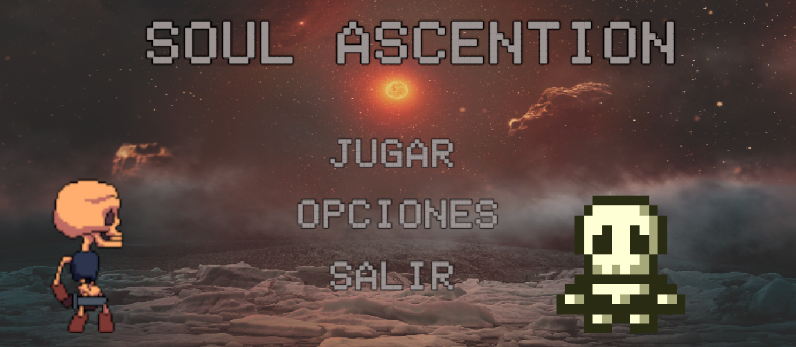

# SoulAscention

##Historia
  * Un fantasma logra escapar del inframundo y quiere encontrar su alma para poder regresar a la vida, para esto tiene pasar por diferentes laberintos y encontrar las llaves para poder salir y avanzar al siguiente. En el primer nivel tiene que escapar de los calabozos donde está resguardado esperando para ser juzgado, para salir debe encontrar la puerta de salida y encontrar # gemas para poder salir, sin ser atrapado por el guardia. 
El siguiente nivel será salir de las catacumbas, para esto tendra encontrar la salida y # de gemas para poder salir evitando ser atrapado por canserbero.
Para el siguiente nivel tendrá que escapar del cementerio buscando su tumba y objetos que necesitará para recuperar su cuerpo después debe encontrar la salida, evitando ser atrapado por la muerte. 
Al escapara caminara hacia su libertad y de regreso a la vida..

## Menú principal

  

